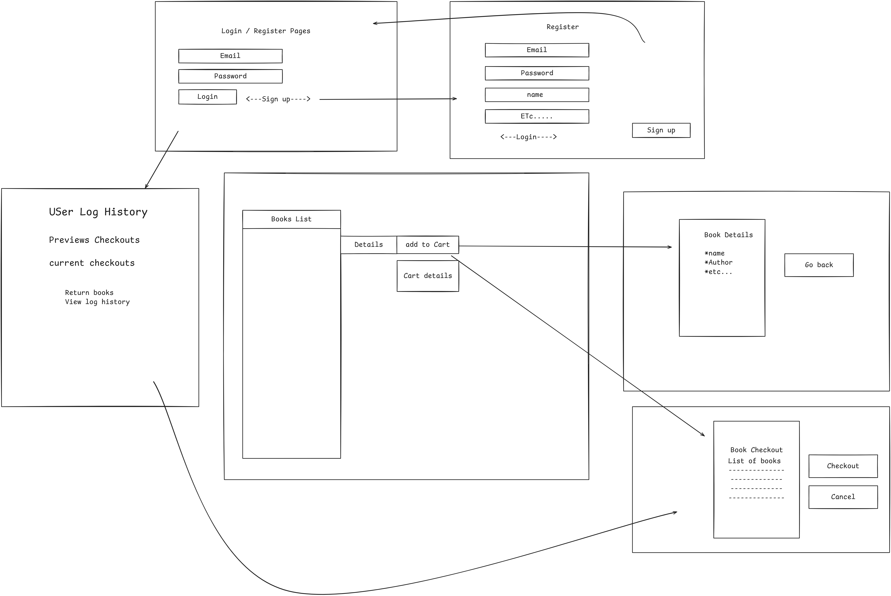
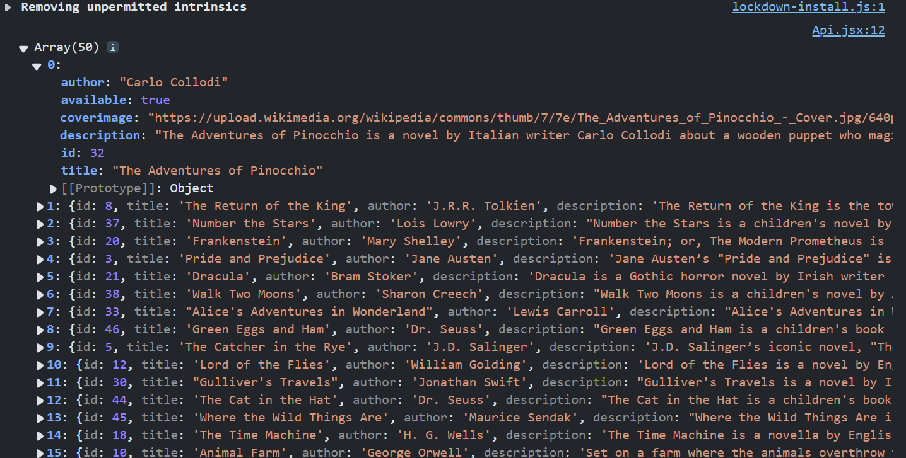
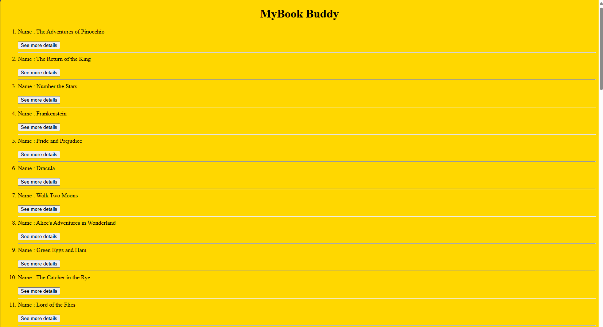
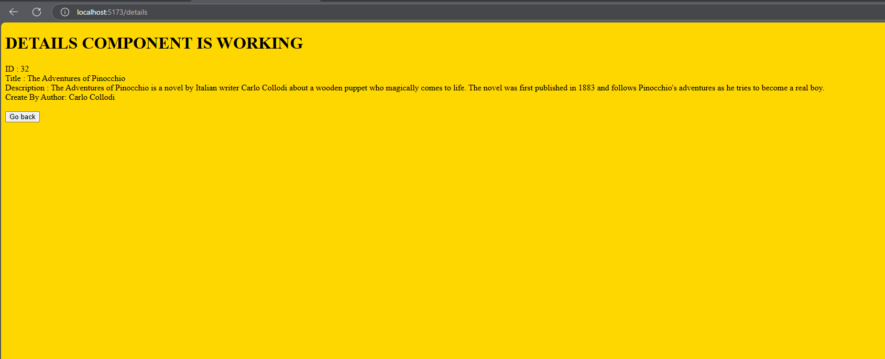
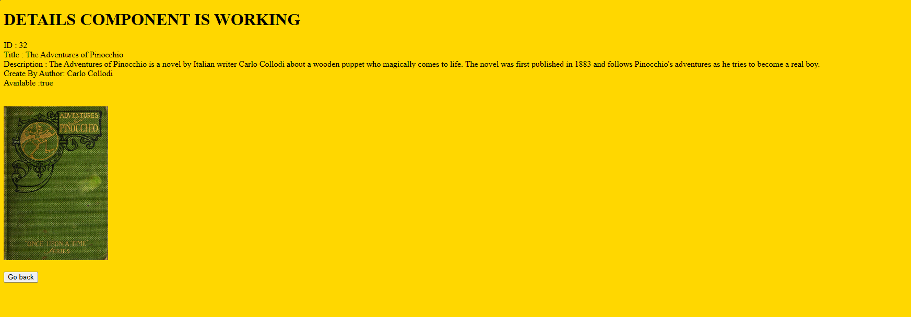

# My BookBuddy APP
```
In this Career Simulation, Calliope is asking you to build the front 
end of the online public library service called BookBuddy.
Review the tabs below for more details and information 
from her and the team who developed the API.


Requirements
Tier I - Build a basic Frontend Application
All users should be able to:
See all books in the library’s catalog
View details of an individual book
Log in to an existing account
Register a new account
Tier II - Logged in Functionality
Logged in users should be able to:
Checkout an available book
View their account details
Name
Email
Books currently checked out
Users should be able to return books that they previously checked out.
 ```

 -----

 

 ### Fetch data return 
 
 
### See all books in the library’s catalog
 

### View details of an individual book
 

 ### Fixing an issues in Details Component 
The first issue I encountered was rendering the "Available" keyword from the API value, which was a boolean. I resolved this by using the .toString() method to convert the boolean value to a string. This also led me to figure out how to display the pictures using the URL tag for the ``

----

 