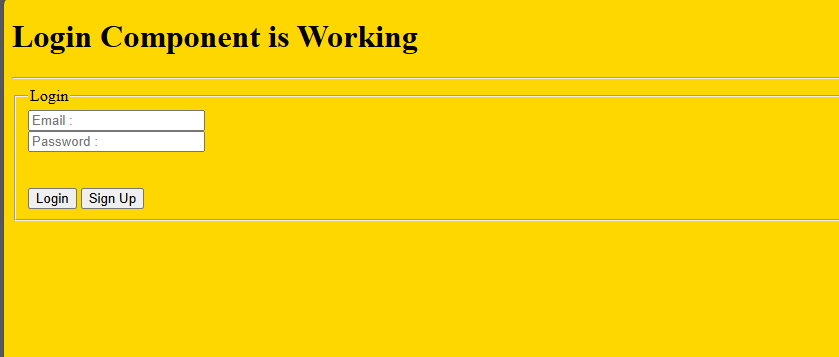
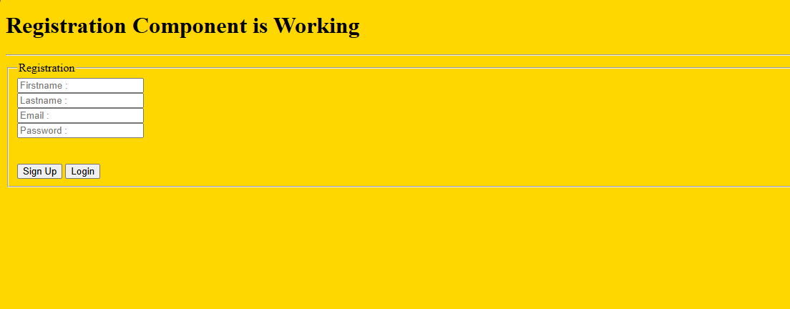
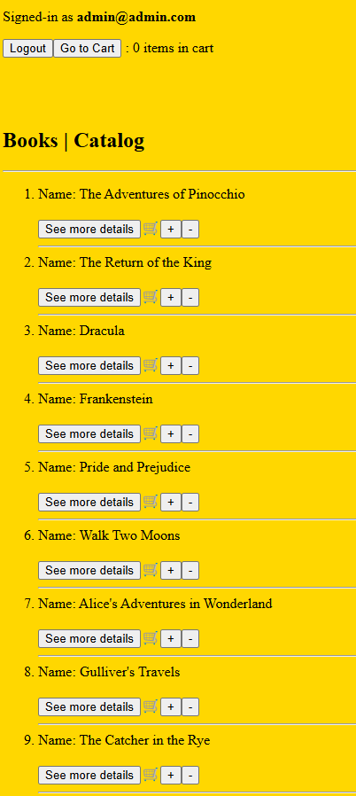
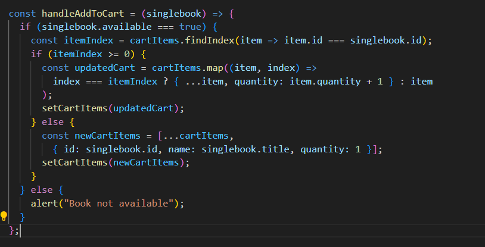
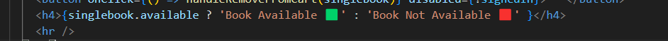
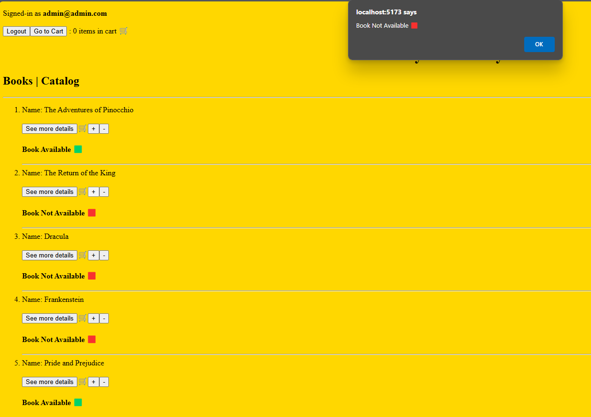
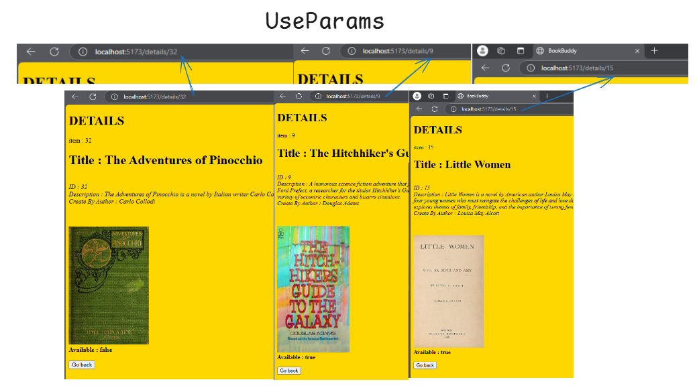
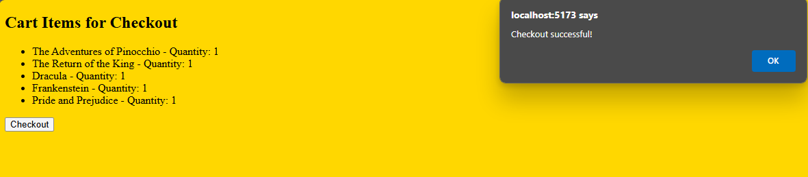

# My BookBuddy APP
```
In this Career Simulation, Calliope is asking you to build the front 
end of the online public library service called BookBuddy.
Review the tabs below for more details and information 
from her and the team who developed the API.


Requirements
Tier I - Build a basic Frontend Application
All users should be able to:
See all books in the library’s catalog
View details of an individual book
Log in to an existing account
Register a new account
Tier II - Logged in Functionality
Logged in users should be able to:
Checkout an available book
View their account details
Name
Email
Books currently checked out
Users should be able to return books that they previously checked out.
 ```

 -----

 

 ### Fetch data return 
 
 
### See all books in the library’s catalog
 

### View details of an individual book
 

 ### Fixing an issues in Details Component 
The first issue I encountered was rendering the "Available" keyword from the API value, which was a boolean. I resolved this by using the .toString() method to convert the boolean value to a string. This also led me to figure out how to display the pictures using the URL tag for the ``

----

 


 ### Login / Registration 
 
 Rendering components 
 

 


 ### Shopping cart
 


 "More work is needed. You should only add the available books. This can be easily done by adding an if condition that checks the Available keyword, which has a true or false value. Based on this, I can resolve the issue."

### fixed it books Available | Book Not Available
Using the singlebook.available keyword with true or false values, I created conditions to add books to the shopping cart based on true values. If the value is false, an alert is shown to the user. 
 
 
 Additionally, I added a tag indicating whether the book is available to guide users before they click "Add to Cart".if the user click on add cart , an alert message will pop 
 to remind the user that the book is not available.
 

### UseParams added 


-----
 ### Checkout Cart
 
"More work is needed. I need to integrate user details during checkout and send the information to the reserved API. Additionally, I will create a component to track these transactions, which will later be used to manage book returns and maintain a log."
 
 ### CSS Style 
"I still need to work more on this part, but I’ve been focusing more on the logic rather than the styling of the pages."